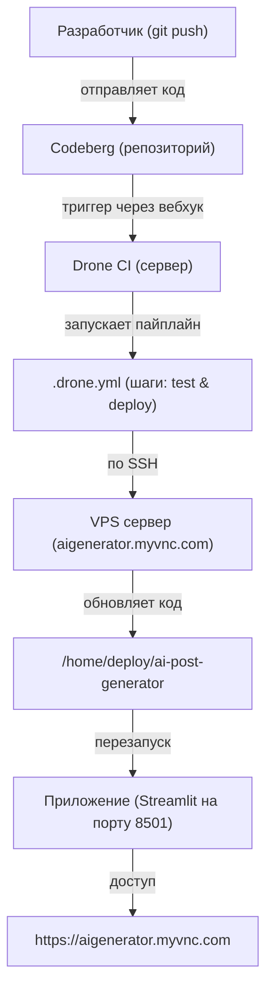

## CI/CD Архитектура: Codeberg → Drone → VPS

### Описание

- **Триггер:** push в Codeberg → Webhook → Drone CI
- **Пайплайн:** `.drone.yml` (test → deploy)
- **Деплой:** SSH → VPS → git pull → restart сервиса