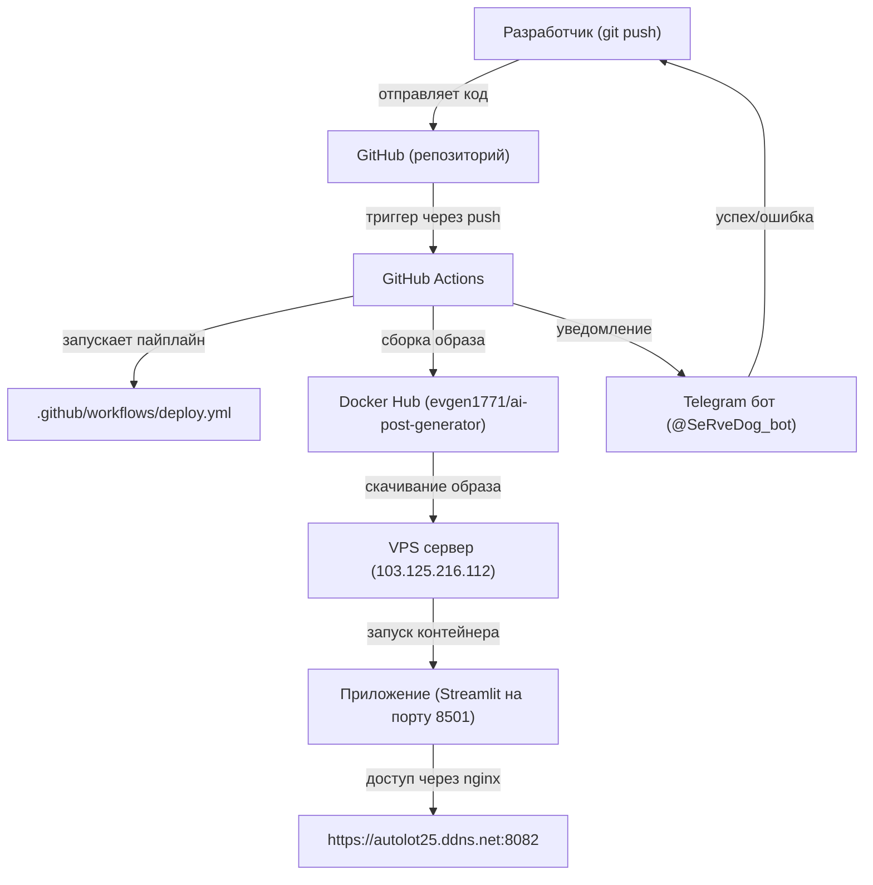

##  CI/CD Архитектура: GitHub → GitHub Actions → VPS

Описание
Триггер: push в main → GitHub Actions

Пайплайн: .github/workflows/deploy.yml (build → push → deploy)

Сборка: Docker образ → Docker Hub

Деплой: SSH → VPS → docker pull → docker compose up -d

Уведомления: Telegram бот @SeRveDog_bot

📦 Приложение
Название: Telegram Post Generator

Доступ: https://autolot25.ddns.net:8082

Логин: admin / Bash_2026

Технологии: Streamlit, Python, PostgreSQL, Docker

AI: OpenRouter (текст) + Pollinations (изображения)

Языки: 4

